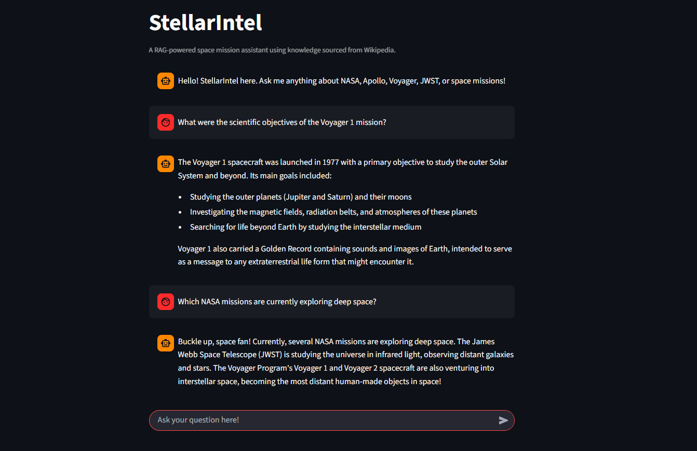

# StellarIntel – Offline RAG Chatbot for Space Knowledge



A fully offline Retrieval-Augmented Generation (RAG) system that enables accurate question-answering over NASA-related topics using only authoritative Wikipedia sources.
---
### Project Overview

StellarIntel demonstrates a complete end-to-end RAG pipeline built with modern LangChain 1.0+, running 100% locally without any external API dependencies.

- **Knowledge Base**: 5 high-quality Wikipedia articles (NASA, Apollo program, Voyager program, James Webb Space Telescope, List of NASA missions)  
- **Total Chunks**: 757  
- **Embedding Model**: `all-MiniLM-L6-v2` (HuggingFace)  
- **Vector Store**: Chroma (persistent local database)  
- **Retriever**: Similarity search with k=5  
- **LLM**: Llama 3.2 3B (via Ollama) – runs entirely offline  
- **Frontend**: Streamlit
---
### Key Technical Components

- Document loading from Wikipedia with proper User-Agent handling  
- Text splitting using `RecursiveCharacterTextSplitter` (1000 tokens, 200 overlap)  
- Local embedding generation and persistent vector storage  
- Retrieval chain with context-aware prompting  
- Stuff documents chain for final answer generation  
- Clean separation of retrieval and generation stages (true RAG)
---
### Local Setup

```bash
ollama pull llama3.2
streamlit run app1.py
